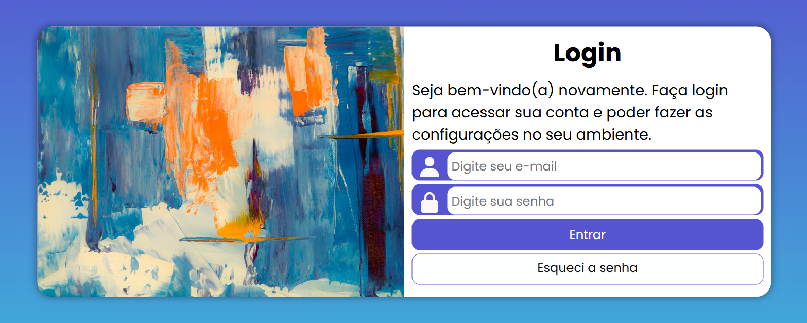

# Projeto login

Tela de login responsiva desenvolvida como estudo prático de **HTML5** e **CSS3**, com base no conteúdo do **Curso em Vídeo**.

O projeto tem como objetivo praticar a construção de uma interface de autenticação visual, usando estrutura semântica em HTML, estilização com CSS, formulário de login, ícones externos, imagem de fundo e adaptação do layout para diferentes tamanhos de tela.

> Projeto de estudo. A tela possui formulário visual, mas não contém backend funcional de autenticação.

## Sobre o projeto

O `projeto-login` apresenta uma tela de login com visual moderno e responsivo. A página contém uma área de imagem, um formulário com campos de login e senha, botão de entrada e link para recuperação de senha.

A proposta principal é treinar conceitos de:

- Estruturação de páginas com HTML5;
- Criação de formulários;
- Uso de campos obrigatórios e atributos de validação;
- Estilização com CSS3;
- Responsividade com Media Queries;
- Organização de arquivos em pastas;
- Uso de fontes e ícones externos;
- Construção de layout adaptável para celular, tablet e desktop.

## Tecnologias utilizadas

- HTML5
- CSS3
- Media Queries
- Google Fonts
- Boxicons

## Estrutura do repositório

```text
projeto-login/
├── .vscode/
├── estilos/
│   ├── style.css
│   └── media-query.css
├── imagens/
│   └── fundologin.jpg
├── .gitattributes
├── LICENSE
├── README.md
└── index.html
```

## O que tem dentro

### `index.html`

Arquivo principal da aplicação. Ele contém:

- Estrutura base da página;
- Importação dos arquivos CSS;
- Importação dos ícones do Boxicons;
- Importação de fontes do Google Fonts;
- Formulário de login;
- Campo de e-mail/login;
- Campo de senha;
- Botão de envio;
- Link visual para “Esqueci a senha”.

### `estilos/style.css`

Arquivo responsável pela aparência principal da tela, incluindo:

- Reset básico de estilos;
- Definição da fonte;
- Cores do layout;
- Estilo do formulário;
- Estilo dos campos;
- Botões;
- Área de imagem;
- Centralização da tela.

## Tela de login do projeto
<p align="center">
  
</p>

<br>
<br>

### `estilos/media-query.css`

Arquivo responsável pela responsividade do projeto. Ele ajusta o layout conforme o tamanho da tela, mudando a disposição da imagem e do formulário em telas maiores.

### `imagens/fundologin.jpg`

Imagem usada na composição visual da tela de login.

## Como executar o projeto

1. Baixe ou clone este repositório:

```bash
git clone https://github.com/thamiscoder/projeto-login.git
```

2. Acesse a pasta do projeto:

```bash
cd projeto-login
```

3. Abra o arquivo `index.html` no navegador.

Também é possível executar com a extensão **Live Server** no Visual Studio Code.

## Observação sobre o formulário

O formulário possui o atributo:

```html
<form action="login.php" method="post" autocomplete="on">
```

Porém, o repositório não possui o arquivo `login.php`. Isso significa que o projeto é focado na interface visual e no estudo de HTML/CSS, não em autenticação real.

## Aprendizados praticados

- Construção de tela de login;
- Layout centralizado;
- Formulário com validações básicas;
- Uso de `required`, `maxlength`, `minlength` e `autocomplete`;
- Design responsivo;
- Separação de estilos em arquivos CSS;
- Organização simples de projeto front-end.

## Licença

Este projeto está sob a licença MIT. Consulte o arquivo `LICENSE` para mais informações.
